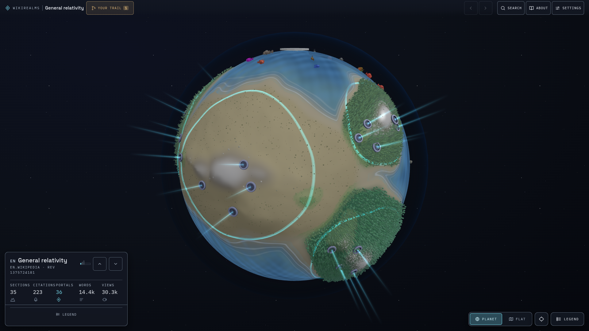
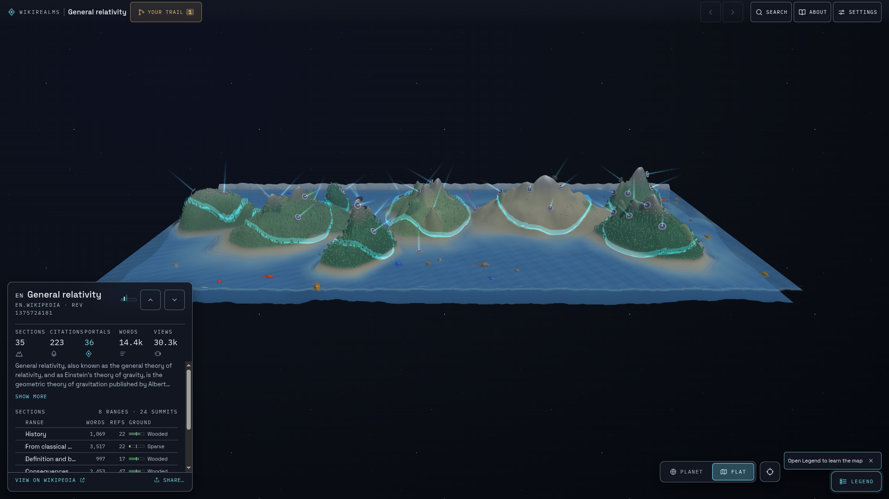

# WikiRealms

[](https://github.com/mooeypoo/WikiRealms/actions/workflows/ci.yml)

**What if a Wikipedia article were a planet?**

WikiRealms takes the shape of a Wikipedia page — its outline, its length, how densely it cites, where its links go, how many people read it — and turns that into geography you can walk. Search for an article, land on its world, and travel outward through the links the article already had.

The English Wikipedia article [General relativity](https://en.wikipedia.org/wiki/General_relativity), for example, is not a scroll of sections. It is a globe: ranges of different heights, some wooded and some bare, with portals standing in the land that mentions them.



## How an article becomes a place

Every world is generated from a specific Wikipedia revision and a specific engine version. The same article, the same revision, the same engine: the same planet, every time. Seeded noise roughens the land so the map looks organic without changing between visits.

The generator reads the article the way a cartographer would read a survey:

1. **The outline becomes terrain.** Each top-level section is a mountain range. Nested subsections rise as peaks along its spine.
2. **Prose sets the relief.** A section's own text raises its summit; the size of everything nested beneath it sets how broad the range is. A long, detailed section is a high mountain. A short one is a hill.
3. **Length sets the waterline.** A stub floods. A long article drains and shows more land.
4. **Citations paint the ground.** How well a section cites, compared with the rest of *this* article, chooses among six bands — from bare dunes through scrub, meadow, and woodland to closed canopy. A poorly sourced article stays dry throughout: the greens are only available to a page that cites well overall. Rock and snow then weather the heights on top of that colour, so a well-sourced summit reads as damp mossy stone where a barren one is dry scree.
5. **Links become portals.** An outbound Wikipedia link is a gate in the range whose section mentions it. Step through and you arrive in that article's world.
6. **Pageviews fill the seas.** Quieter articles host sparse fish; heavily read ones fill the water. Land stays clear of animals.

Unwrapped onto a map, the same General relativity world shows the ranges as geography: History, Astrophysical applications, Relationship with quantum theory, and the rest, each with its own height, breadth, and ground.



## Reading the land

In short:

| On the world | In the article |
| --- | --- |
| A mountain range | A top-level section |
| Peak height | That section's own prose |
| Range breadth | The subsection tree beneath it |
| Waterline | Total article length |
| Ground colour and trees | How well that section cites, relative to its neighbours |
| Bare dunes | A section with no references at all |
| Rock and snow on the heights | How much was written toward the summit |
| A portal | An outbound Wikipedia link |
| Fish in the seas | Thirty-day pageviews |

Your trail remembers the path you walked. Share a single realm, or the whole journey.

Wikipedia remains the source: the prose, the citations, and the invitation to improve a barren slope all still live there.

---

Made with curiosity by [Moriel Schottlender](https://moriel.tech).

Fish models from the [Cute Fish Pack](https://quaternius.com) by [Quaternius](https://www.patreon.com/quaternius) (CC0). Portal fountains use the [Fantasy Town Kit](https://kenney.nl/assets/fantasy-town-kit) by [Kenney](https://kenney.nl) (CC0).

WikiRealms is free software: you can redistribute it and/or modify it under the terms of the [GNU General Public License](LICENSE) as published by the Free Software Foundation, either version 3 of the License, or (at your option) any later version.

---

## For builders

A Vue 3 app with a Three.js globe, deterministic generation in the browser, and no database. It deploys as a static site on Netlify. Wikipedia is fetched from the client; a same-origin redirect proxies Wikimedia pageviews so requests can carry a proper User-Agent. Session state stays in memory, with optional snapshot export/import.

**Stack.** Vue 3, Vite, Three.js, simplex-noise, [banana-i18n](https://github.com/wikimedia/banana-i18n). Tests with Vitest. Hosted on Netlify.

### Run locally

```bash
npm install
npm run dev      # Vite at http://localhost:5173
npm test         # Vitest
npm run build    # production build
npm run check    # test + build (what CI runs)
```

`npm run storybook` starts a component workbench. Pull-request deploys on Netlify also serve it at `/storybook`.

### Project structure

Domains stay separated so fetching, generation, and presentation can change independently. Tests under `tests/architecture/` enforce the import rules.

```
src/core/        Pure domain logic — articles, editions, snapshots, traversal.
                 Knows nothing about Vue or the network.

src/engine/      World generation. Turns a parsed section tree into terrain,
                 biomes, and portals. Deterministic; versioned separately
                 from Wikipedia content. No UI, no fetching.

src/adapters/    The outside world — Wikipedia / Wikimedia APIs, URL state,
                 local snapshot storage.

src/ui/          Vue. `design/` is reusable chrome that knows nothing about
                 articles. `rendering/` turns world data into geometry.
                 `content/` holds copy. `components/` and composables
                 assemble the experience.

tests/           Mirrors `src/`, kept separate so the app can ship cleanly.
docs/            Design notes: vision, generation, model, architecture.
```

A world key is conceptually `articleId + revision + engine version`. `articleId` is already per Wikipedia (`en:736`, `de:736`): language edition plus that wiki's page id, so the same title on two Wikipedias is two worlds. Change the article on Wikipedia and the planet can go stale; change the generator and old worlds remain reproducible from their engine version.

Further reading: [`docs/vision.md`](docs/vision.md), [`docs/generation.md`](docs/generation.md), [`docs/architecture.md`](docs/architecture.md).
